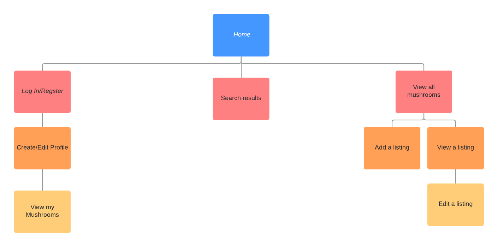
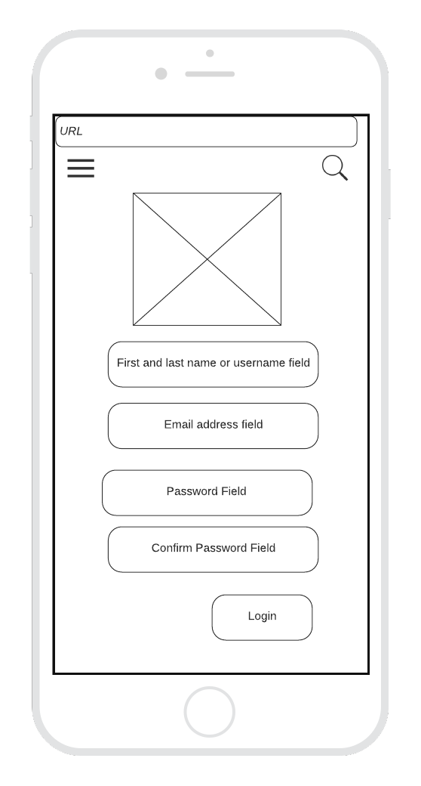
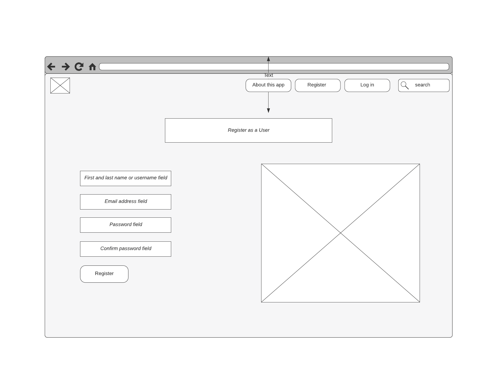
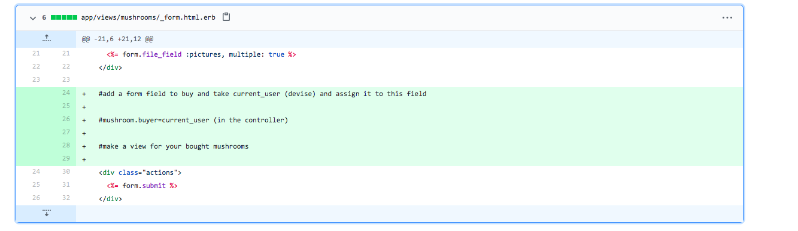

# README

## R7	Identification of the problem you are trying to solve by building this particular marketplace app.

**Demonstrates a full understanding of the problems that exist in a relevant marketplace that needs disrupting 6points**

Mushroom foraging is booming in popularity amongst the upwardly-mobile middle classes seeking a relaxing, nourishing and wholesome activity in nature. Mushrooms are difficult to cultivate and propagate unpredictably. However, once established in a particular location, they will reliably return soon after picking (so long as sufficient care is taken to minimise destruction to the undergrowth). This means that people who forage mushrooms usually keep a record of good mushrooms locations they have found, and often share these with other foragers. Unfortunately, this information economy suffers from a lack of connectedness – mushroom foragers being notably reclusive and poor communicators. This app exists to solve this problem. It allows mushroom foragers to list and search for locations where mushrooms can be found. Users can then indicate their intention to pick mushrooms in this location, at a certain time, thus ensuring that no other foragers will interrupt their solitary enterprise. They also have an option to leave a tip, to show their appreciation (or a comment to provide further information on their foraging experience). Several imbricated problems are solved: hunger, disinclination to see or speak to other humans, and the desire for the pleasures of a good 'shroom haul.  

## R8	Why is it a problem that needs solving?

As younger generations come of age in an era of climate catastrophe, more and more members of the Gen Z and millennial cohorts are turning to the earth for answers to their own wellbeing – and the health of the planet. Environmental stewardship is infused with the language of anti-capitalist activism and an emphasis on living more reciprocally with nature amid an economy of extraction. The study of fungi is fundamentally about the joy of mastery, of learning the taxonomies and ecology of a notoriously complex family of organisms. The stakes are thrillingly high: anything less than absolute certainty in one’s identification of a wild edible mushroom species can land its eater in the hospital – or, in some circumstances, the grave Endlessly complex, mushrooms unlock a portal of exciting possibility – a future that utilizes regenerative, fungus-derived plastics and Styrofoam-like packing materials, and that even taps into mycelial networks to graft artificial organs. The growing discipline of mycoremediation has opened new windows for harnessing mycelia to filter environmental pollutants and, help “clean up the messes humans have made”. Further, mental and physical benefits are promoted by, for example, mycologist Paul Stamets who declared on a lengthy 2017 episode of The Joe Rogan Experience that “psilocybin should be looked upon as a nootropic vitamin” (Korducki 2019)

Reconnecting a politics of commitment and of ethical obligation with an ontology of more than human worlds without falling back into classic humanist categories of thought requires a speculative effort. It specifically poses the question of the compatibility of distributed agency and decentering the human subject with situated ethical obligations and commitments. That this is a tricky problem is well stated in how Lucy Suchman reminds us that when engaging with technoscientific assemblages “the price in recognizing the agency of artefacts need not be the denial of our own” (Suchman 2007b, 285). In this direction, the discussion of care in this app ultimately relates to how we conceive of a critical or, political, ethos in posthumanist thinking, of an “insurgent posthumanism” (Papadopoulos 2010). Indeed, the reclamation of care in approaches to more than human worlds marked by technoscience is a political project that defies the traditional ethical boundaries that have marked critical thinking. Following the trope of care into an “unexpected country” (Haraway 2011) of blurred boundaries – moral as much as material – requires opening up its possible meanings (Puig de la Bellacasa 2017).

## R9	A link (URL) to your deployed app (i.e. website)

https://aqueous-sea-29087.herokuapp.com/

## R10	A link to your GitHub repository (repo).

https://github.com/alisay/mush

## R11	Description of your marketplace app (website), including:
### Purpose

To allow the sharing of information about locations where mushrooms may be foraged. 

### Functionality / features

Users are able to create an account, log in, add information to their user accounts, create listings, add information and images to their own listings, make bookings, and leave a tip on others' listings. Users must be logged in to access listings so as to foster a community vibe.

### Sitemap



### Screenshots

#TODO last

### Target audience

Environmentally and socially conscious mycologists living in cool, moist environments. 

### Tech stack (e.g. html, css, deployment platform, etc)

* Front-end: HTML5, SCSS, Embedded Ruby, Javascript, jQuery
* Back-end: Ruby 2.7.1, Ruby on Rails 6.0.3.2
* Database: Postgresql.
* Deployment platform: Heroku.
* Utilities: Stripe, Devise, AWS S3, Google Maps
* DevOps: Git, Github, VS Code, Bundler, Lucidchart.

## R12	User stories for your app

**User stories are well thought out, relevant, and comprehensively cover the needs of the app 6 points**

* As a person interested in mushroom locating apps, I want to create an account using my email address and a chosen password, so that I can access the app.
* As a registered user, I want to be able to define my name on the app, so that I may appear unique.
* As a logged in user, I want to be able to log out, so that I can protect my information from others and/or sign up again using different information. 
* As a logged out user, I want to be able to log back in, so that I may return to the information that existed before I logged out. 
* As someone who knows where to find mushrooms, I want to create a listing of that location on the app, so that I can share this information with other people who might be interested. 
* As someone who has created a listing on the app, I want to be able to add information to that listing, like the geographical coordinates of the location, and which mushrooms may be found there, and images of said mushrooms, so as to maximize the utility of that listing. 
* As someone who has created a listing on the app, I want to be able to modify or delete that listing, in case I have made an error in the listing and do not want people to be mad at me. 
* As someone who has created a listing on the app, I want to be the sole person who can modify the information contained in that listing, so that I may assert ownership over the consistency and correctness of information attached to my name and profile. 
* As someone who wishes to collect and then eat delicious mushrooms, I want to view individual listings of locations where mushrooms may be found and associated information like geographical coordinates and images, so that I can consider the merits of the location and mushrooms that can be found there. 
* As someone who know what kind of mushroom I am seeking, I want to be able to search listings on the app according to that mushroom name, so that I may see a list of matching listings and click through to view those listings.
* As someone who does not have a strong preference or idea about what mushroom I am seeking, I want to view the full list of available mushroom locations, in order to be fully informed about my options. 
* As someone who has found a mushroom location where I wish to collect mushrooms, I want to reserve the right to collect mushrooms in that location, so that I can minimize the chance that other foragers will be present at the site concomitant to me. 
* Being physically located in space and cannot easily travel, I want to see mushroom locations that are near to my present location, so that I can best use my time to travel to that location. 
* Having indicated that I wish to forage for mushrooms in a particular location at a particular time, I would like to view a list of those bookings, so that I may attend those in my own time, or delete them if I no longer wish to attend.

## R13	Wireframes for your app

**More than five detailed and well designed wireframes provided, for several different screen sizes (as required for the app) 6 points**

| | Mobile | Web/Tablet |
|:---:|:---:|:---:|
|Home Page| ||
|Browse Mushrooms|||
|Register | ||
|Menu | ||


## R14	An ERD for your app

**Flawless, complex, complete, and well thought through ERDs provided 6 points**

### Planned ERD: 


### Final ERD:

**ERD provided represents a normalised database model 6 points**
Meets D with no duplication and ideal definition of entities.
ERD is complete with appropriately defined entities (models each serve a single purpose and appropriate fields). 

#TODO with dbdesigner

### Explanation of discrepancies with final ERD:

The initial designed ERD represents the minimum viable product for this app. It allow for users to sign up, list mushrooms and reserve or "purchase" them. The final ERD includes several additional models which are intended to allow for the stretch goals of this app: geolocating the mushroom picking locations and reserving the location for a specific time and date. In addition, the final ERD shows the additional models created by ActiveStorage. Rails active_storage:install creates two tables: active_storage_blobs and active_storage_attachment. The first table carries the picture file itself and metadata, while the second links the blob to the model and record to which it is attached. This is an example of a polymorphic association, because the blob can be linked to multiple models.  

## R15	Explain the different high-level components (abstractions) in your app

**Precisely explains and shows understanding of the different high-level components of the app 6 points**

Some of the high-level components in the app are: 

Mushroom meadows: this is a location where mushrooms grow. It is geolocated to a specific set of coordinates, and can provide additional information like the kind of mushroom that has been spotted there, and some images of the location and mushrooms. Users who are registered to use the site can either act as a "seller" by listing these locations on the app, or "buyer" by claiming the location for a specific date and time. 

Users: In order to use the site, someone must register as a user. This allows them to create a profile, attached to their email address and password. Unregistered users can still browse the mushrooms listing page and search results, but cannot view the details of individual listings. 

Map: the map view allows users to see a visual representation of the mushroom locations near to them. They can also calculate the time needed to travel to those locations, and from this make a decision about which listing to reserve. 

## R16	Detail any third party services that your app will use

**Includes a complete and detailed description of third party services used in the app 6 points**

* Amazon S3

Amazon Simple Storage Service is a cloud-based object storage service. This app uses it in conjunction with Active Storage to allow users to upload and save images to their listings. 

* Bootstrap-sass

Bootstrap-sass is a Sass-powered version of Bootstrap 3. It is a free and open source framework directed at responsive, mobile-first, front-end web development, through providing design templates for interface components like forms, buttons and navigation. In this app, it is used to make the user interface less cluttered and more navigable. 

* Devise

Devise is a cookie/session-based authentication solution for Rails. Authentication is the process of verifying whether someone or something is who or what it declares itself to be. This app uses devise authenticatable to hash and store a password in the database to validate the authenticity of a user while signed in.

* Heroku

Heroku is a platform as a service (PaaS) that enables developers to build, run, and operate applications entirely in the cloud. This app is deployed on heroku. 

* Stripe

Stripe is an online payment processing infrastructure. In this app, it allows users to leave a tip, redirecting them to a payment gateway and sending back API endpoints when payment is confirmed. 

## R17	Describe your projects models in terms of the relationships (active record associations) they have with each other

**Complete discussion of the project’s models with an understanding of how its active record associations function 6 points**

Rails supports six types of associations: belongs_to; has_one; has_many; has_many :through; has_one :through; has_and_belongs_to_many

In this app, it is planned that:  
* A user has_one :profile
* A profile belongs_to :user, has_one :seller
* A seller belongs_to :profile, has_many :mushrooms, has_and_belongs_to_many :buyers
* A buyer belongs_to :profile, has_many :mushrooms, has_and_belongs_to_many :sellers
* A mushroom listing belongs_to :seller, has_many_attached :pictures

by declaring that profile belongs to user, buyer and seller belong to profile and mushroom belongs to seller, this app instructs Rails to maintain Primary Key-Foreign Key information between instances of the two models. The has_one association between user and profile, and profile and seller also set up a one-to-one connection with another model, indicating that each instance of the model contains or possesses one instance of the other model. A has_many association indicates a one-to-many connection with another model. The seller and buyer models have a has_and_belongs_to_many association. This means they have a direct many-to-many connection with each other, with no intervening model. This app is not designed to make use of the has_many or has_one :through associations. 

## R18	Discuss the database relations to be implemented in your application

**Provides coherent discussion of the database relations, with reference to the ERD 6 points**

As can be seen in the planned ERD provided, there are five database tables, namely: users, profiles, buyers, sellers, and mushrooms, and a join table for buyers and sellers. The profile table has a row establishing a one to one relationship with the users table using a foreign key. Both buyers and sellers have a one to one relationship with the profile table, this being established through a foreign key in these tables referring to the profile ID primary key. Meanwhile, buyers and sellers have a many-to-many relationship through the buyers-sellers join table. Finally, the mushroom table has two rows referring to the foreign keys of buyer ID and seller ID. Both these relationships are one to many; that is, a buyer and seller have zero or many mushrooms, while a mushroom has one and only one buyer or seller. 

## R19	Provide your database schema design
```ruby
  create_table "buyers", force: :cascade do |t|
    t.bigint "profile_id", null: false
    t.datetime "created_at", precision: 6, null: false
    t.datetime "updated_at", precision: 6, null: false
    t.index ["profile_id"], name: "index_buyers_on_profile_id"
  end

  create_table "buyers_sellers", force: :cascade do |t|
    t.bigint "buyer_id", null: false
    t.bigint "seller_id", null: false
    t.datetime "created_at", precision: 6, null: false
    t.datetime "updated_at", precision: 6, null: false
    t.index ["buyer_id"], name: "index_buyers_sellers_on_buyer_id"
    t.index ["seller_id"], name: "index_buyers_sellers_on_seller_id"
  end

  create_table "mushrooms", force: :cascade do |t|
    t.string "flavour"
    t.bigint "seller_id", null: false
    t.datetime "created_at", precision: 6, null: false
    t.datetime "updated_at", precision: 6, null: false
    t.bigint "buyer_id"
    t.boolean "purchased", default: false
    t.index ["buyer_id"], name: "index_mushrooms_on_buyer_id"
    t.index ["seller_id"], name: "index_mushrooms_on_seller_id"
  end

  create_table "profiles", force: :cascade do |t|
    t.string "name"
    t.bigint "user_id", null: false
    t.datetime "created_at", precision: 6, null: false
    t.datetime "updated_at", precision: 6, null: false
    t.index ["user_id"], name: "index_profiles_on_user_id"
  end

  create_table "sellers", force: :cascade do |t|
    t.bigint "profile_id", null: false
    t.datetime "created_at", precision: 6, null: false
    t.datetime "updated_at", precision: 6, null: false
    t.index ["profile_id"], name: "index_sellers_on_profile_id"
  end

  create_table "users", force: :cascade do |t|
    t.string "email", default: "", null: false
    t.string "encrypted_password", default: "", null: false
    t.string "reset_password_token"
    t.datetime "reset_password_sent_at"
    t.datetime "remember_created_at"
    t.datetime "created_at", precision: 6, null: false
    t.datetime "updated_at", precision: 6, null: false
    t.index ["email"], name: "index_users_on_email", unique: true
    t.index ["reset_password_token"], name: "index_users_on_reset_password_token", unique: true
  end
  
  add_foreign_key "buyers", "profiles"
  add_foreign_key "buyers_sellers", "buyers"
  add_foreign_key "buyers_sellers", "sellers"
  add_foreign_key "mushrooms", "buyers"
  add_foreign_key "mushrooms", "sellers"
  add_foreign_key "profiles", "users"
  add_foreign_key "sellers", "profiles"
```

## R20	Describe the way tasks are allocated and tracked in your project

I planned and tracked tasts in my project using aspects of the literate programming paradigm, as first advocated by Donald Knuth. This encourages programmers to structure their code as they would an essay – first writing out the program logic in human language and then annotating this with the code to execute the logic described. I was not able to implement the full scope of literate programming due to the fact that a great deal of the rails app structure is dictated by convention. However, I was able to implement it to the extent that I planned and tracked tasks to be completed through adding comments to my code in the locations where I understood additional work to be required. For example, I knew that one of the user stories described reserving the right to pick mushrooms of a certain listing and that this would require modification to the mushroom form. I therefore created a multi-line comment at an early stage of development to indicate the logic this would follow:



This planning stage was tracked through a daily initial scan of the code committed the evening before, and a decision as to which task to focus on for that day. This method of planning and tracking also had the advantage in resulting in comprehensively commented code, as well as the source of truth for the project management process being stored in git alongside the source code and executable files. For further detail, and to see the process in full, please review my git commit history. 

Total: 60 points

Also: (48 points)
Model implementation represents a normalised database model
Database design appropriately addresses the requirements of a complex scenario
Implemented controllers demonstrate correct use of commands to query the database infrastructure
Queries implemented provide correct data for the given scenario
Code comments demonstrate how the queries implemented correctly represent the database structure
Identify and use appropriate model methods
Minimising database calls needed to perform an action and implement eager loading where appropriate
Sanitise and validates input to maintain data integrity
