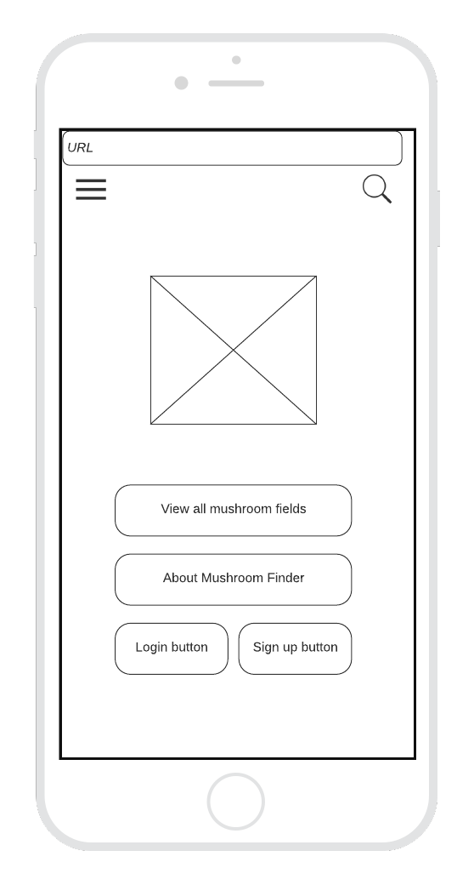
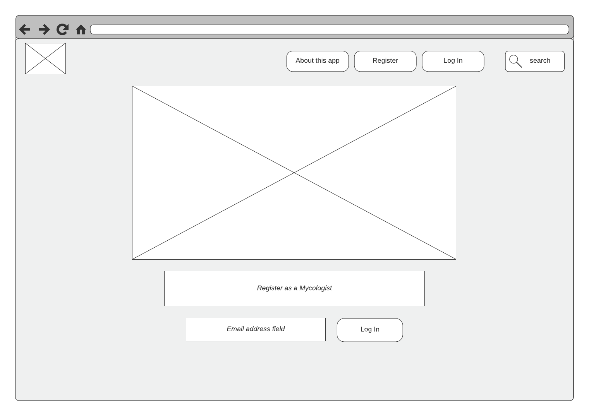
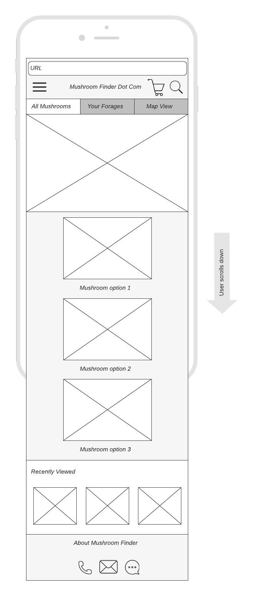
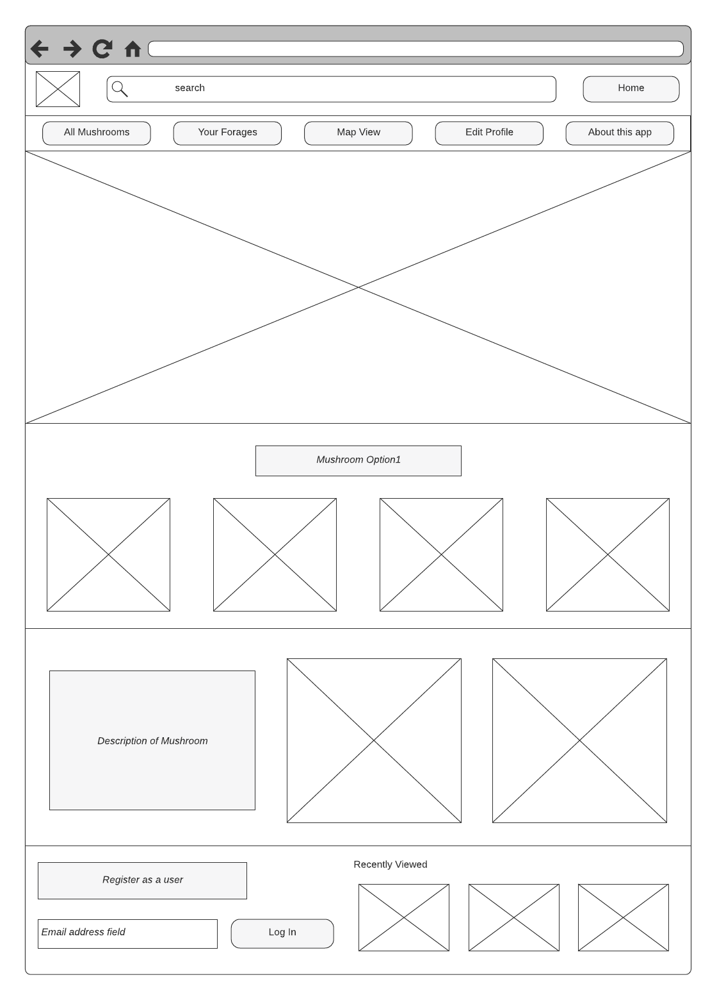
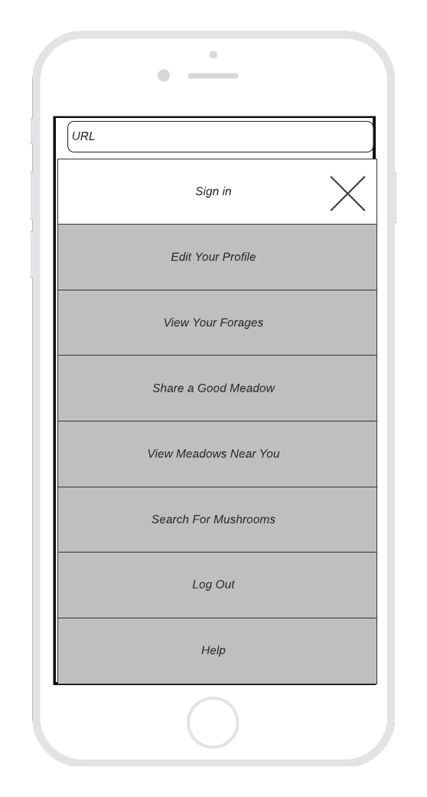
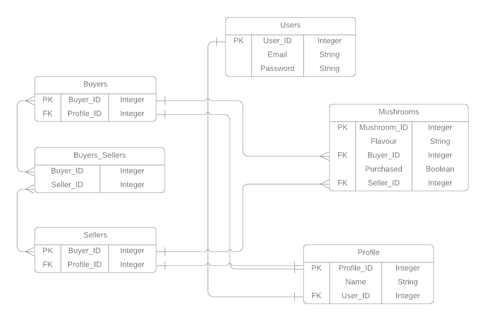

# README

This README would normally document whatever steps are necessary to get the
application up and running.

Things you may want to cover:

* Ruby version

* System dependencies

* Configuration

* Database creation

* Database initialization

* How to run the test suite

* Services (job queues, cache servers, search engines, etc.)

* Deployment instructions

* ...

## R7	Identification of the problem you are trying to solve by building this particular marketplace app.

Demonstrates a full understanding of the problems that exist in a relevant marketplace that needs disrupting 6points

Mushroom foraging is booming in popularity amongst the upwardly-mobile middle classes seeking a relaxing, nourishing and wholesome activity in nature. Mushrooms are difficult to cultivate and propagate unpredictably. However, once they have established themselves in a particular location, they will reliably return soon after picking (so long as sufficient care is taken to minimise destruction to the undergrowth). This means that people who forage mushrooms usually keep a record of good mushrooms locations they have found, and often share these with other foragers. Unfortunately, this information economy suffers from a lack of connectedness – mushroom foragers being notably reclusive and poor communicators. This app exists to solve this problem. It allows mushroom foragers to list and search for locations where mushrooms can be found. Users can then indicate their intention to pick mushrooms in this location, at a certain time, thus ensuring that no other foragers will interrupt their solitary enterprise. They also have an option to leave a tip, to show their appreciation (or a comment to provide further information on their foraging experience). Several imbricated problems are solved: hunger, disinclination to see or speak to other humans, and the desire for the pleasures of a good 'shroom haul.  

## R8	Why is it a problem that needs solving?

As younger generations come of age in an era of climate catastrophe, more and more members of the Gen Z and millennial cohorts are turning to the earth for answers to their own wellbeing – and the health of the planet. Their burgeoning mushroom madness just might be the quintessential sign of the times.

Environmental stewardship was a recurrent theme of conversation throughout, which was infused with the language of anti-capitalist activism and an emphasis on living more reciprocally with nature amid an economy of extraction.

Therein lies the appeal. The study of fungi is fundamentally about the joy of mastery, of learning the taxonomies and ecology of a notoriously complex family of organisms. The stakes are thrillingly high: anything less than absolute certainty in one’s identification of a wild edible mushroom species can land its eater in the hospital – or, in some circumstances, the grave.

Endlessly complex, mushrooms unlock a portal of exciting possibility – a future that utilizes regenerative, fungus-derived plastics and Styrofoam-like packing materials, and that even taps into mycelial networks to graft artificial organs. The growing discipline of mycoremediation has opened new windows for harnessing mycelia to filter environmental pollutants and, as Tzogas puts it, help “clean up the messes humans have made”.

The podcaster Joe Rogan, a vocal advocate of psilocybin use and legalization, beat Pollan to the chase with a lengthy 2017 episode of The Joe Rogan Experience in which the mycologist Paul Stamets declared his belief that “psilocybin should be looked upon as a nootropic vitamin”.

## R9	A link (URL) to your deployed app (i.e. website)

## R10	A link to your GitHub repository (repo).

## R11	Description of your marketplace app (website), including:
### Purpose
To allow the sharing of information about locations where mushrooms may be foraged. 

### - Functionality / features

Users: are able to create an account, log in, add information to their user accounts, create listings, add information and images to listings, and make bookings. Users must be logged in to access listings to foster a community vibe. 

Mushrooms: users can create mushroom listings, modify the information in the listings 

### Sitemap
### Screenshots
### Target audience

Environmentally and socially conscious mycologists living in cool, moist environments. 

### Tech stack (e.g. html, css, deployment platform, etc)

* Front-end: HTML5, SCSS, Embedded Ruby, Javascript, jQuery
* Back-end: Ruby 2.7.1, Ruby on Rails 6.0.3.2
* Database: Postgresql.
* Deployment platform: Heroku.
* Utilities: Stripe, Devise, AWS S3, Google Maps
* DevOps: Git, Github, VS Code, Bundler, Lucidchart.

## R12	User stories for your app

* As a person interested in mushroom locating apps, I want to create an account using my email address and a chosen password, so that I can access the app.
* As a registered user, I want to be able to define my name on the app, so that I may appear unique.
* As a logged in user, I want to be able to log out, so that I can protect my information from others and/or sign up again using different information. 
* As a logged out user, I want to be able to log back in, so that I may return to the information that existed before I logged out. 
* As someone who knows where to find mushrooms, I want to create a listing of that location on the app, so that I can share this information with other people who might be interested. 
* As someone who has created a listing on the app, I want to be able to add information to that listing, like the geographical coordinates of the location, and which mushrooms may be found there, and images of said mushrooms, so as to maximize the utility of that listing. 
* As someone who has created a listing on the app, I want to be able to modify or delete that listing, in case I have made an error in the listing and do not want people to be mad at me. 
* As someone who has created a listing on the app, I want to be the sole person who can modify the information contained in that listing, so that I may assert ownership over the consistency and correctness of information attached to my name and profile. 
* As someone who wishes to collect and then eat delicious mushrooms, I want to view individual listings of locations where mushrooms may be found and associated information like geographical coordinates and images, so that I can consider the merits of the location and mushrooms that can be found there. 
* As someone who know what kind of mushroom I am seeking, I want to be able to search listings on the app according to that mushroom name, so that I may see a list of matching listings and click through to view those listings.
* As someone who does not have a strong preference or idea about what mushroom I am seeking, I want to view the full list of available mushroom locations, in order to be fully informed about my options. 
* As someone who has found a mushroom location where I wish to collect mushrooms, I want to reserve the right to collect mushrooms in that location, so that I can minimize the chance that other foragers will be present at the site concomitant to me. 
* Being physically located in space and cannot easily travel, I want to see mushroom locations that are near to my present location, so that I can best use my time to travel to that location. 
* Having indicated that I wish to forage for mushrooms in a particular location at a particular time, I would like to view a list of those bookings, so that I may attend those in my own time, or delete them if I no longer wish to attend.

## R13	Wireframes for your app

More than five detailed and well designed wireframes provided, for several different screen sizes (as required for the app) 6 points

| | Mobile | Web/Tablet |
|:---:|:---:|:---:|
|Home Page| ||
|Browse Mushrooms|||
|Menu | ||

## R14	An ERD for your app

### Planned ERD: 

ERD provided represents a normalised database model
Meets D with no duplication and ideal definition of entities.
ERD is complete with appropriately defined entities (models each serve a single purpose and appropriate fields). 6 points

## R15	Explain the different high-level components (abstractions) in your app

Precisely explains and shows understanding of the different high-level components of the app 6 points

## R16	Detail any third party services that your app will use

Includes a complete and detailed description of third party services used in the app 6 points

## R17	Describe your projects models in terms of the relationships (active record associations) they have with each other

Complete discussion of the project’s models with an understanding of how its active record associations function 6 points

## R18	Discuss the database relations to be implemented in your application

Provides coherent discussion of the database relations, with reference to the ERD 6 points

## R19	Provide your database schema design

Flawless, complex, complete, and well thought through ERDs provided 6 points

## R20	Describe the way tasks are allocated and tracked in your project

Shows significant planning for how tasks are planned and tracked, including a full description of the process and of the tools used 6 points

comments/literate programming

Total: 60 points

Also: (48 points)
Model implementation represents a normalised database model
Database design appropriately addresses the requirements of a complex scenario
Implemented controllers demonstrate correct use of commands to query the database infrastructure
Queries implemented provide correct data for the given scenario
Code comments demonstrate how the queries implemented correctly represent the database structure
Identify and use appropriate model methods
Minimising database calls needed to perform an action and implement eager loading where appropriate
Sanitise and validates input to maintain data integrity
